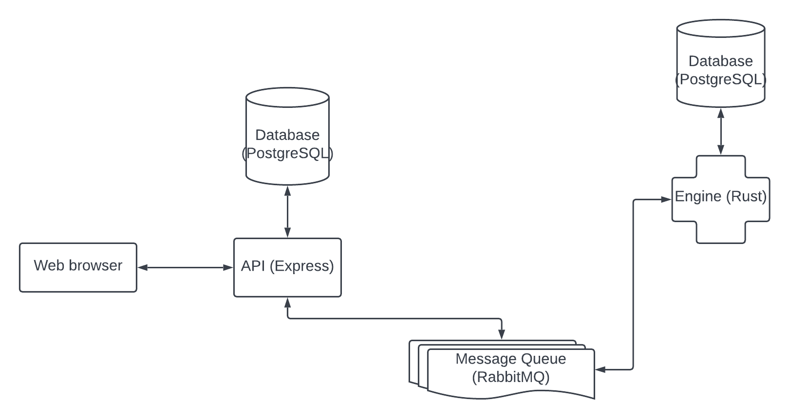

<div align="center">
    

# Pass 🔑
A authenticator for your accounts.

</div>


## Components
 - **Engine**: The core of the Pass.
 - **API**: The API for the Pass.


## Running with Docker Compose in development mode
To run the Pass, run the following command:
```bash
docker compose up -d
```


# Pass architecture
The Pass architecture is composed with microservices, each one with a specific task. The microservices are:
 - **Engine**: The core of the Pass, resposible to manage the accounts and the authentication.
  
 - **API**: The API for the Pass, resposible to expose the endpoints, manage OAuth2 authentication and Pass accounts.

Here is the architecture diagram:

# License
[Apache-2.0](./LICENSE)